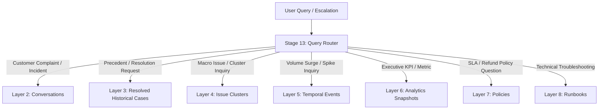

# RAG Architecture Audit & Typed Knowledge Layer Design: RootIQ UC18

## Executive Summary

This read-only architecture audit evaluates the current codebase of RootIQ UC18 across NLP text separation, conversation representation, field completeness, Stage 9–12 RAG indexing, query routing, and 2.81M-row scalability.

Based on empirical inspection of the codebase and `data/knowledge/knowledge_documents.parquet`, the current foundation is sound, but Stage 9–12 currently builds a **single monolithic TF-IDF / BM25 index** containing heterogeneous document types. To scale safely to ~2.81M rows, the retrieval architecture must transition to **partitioned, typed knowledge layers** managed via the Query Router.

**Audit Verdict**: `ARCHITECTURE READY FOR IMPLEMENTATION`

---

## 1. NLP Customer / Company Text Separation Audit

### Verified Findings
* **Text Selection Logic**: In [pipeline/stage04_nlp.py](file:///c:/Users/prem/Downloads/rootiq_rag/rootiq_rag/pipeline/stage04_nlp.py#L48), Stage 4 extracts `cust_text = turns[0]["text"] if turns else "No content"` from each reconstructed conversation thread.
* **Thread Root Order**: In [pipeline/stage03_conversations.py](file:///c:/Users/prem/Downloads/rootiq_rag/rootiq_rag/pipeline/stage03_conversations.py#L139), conversation turns are sorted chronologically (`thread_turns.sort(key=lambda t: t.timestamp)`). In TWCS customer service data, threads originate from inbound customer tweets (`inbound == True`), placing customer text at `turns[0]`.
* **Company Reply Isolation**: Company replies (`role == "company"`) are stored in `turns[1:]` within `Conversation.turns`. Stage 4 does **not** pass `turns[1:]` to `NLPProvider.analyze_text()`. Thus, company outbound replies are **not** classified as customer complaints.
* **Code Gap**: Line 48 in `stage04_nlp.py` lacks an explicit defensive check (`[t for t in turns if t.role == "customer"]`). If a conversation thread starts with a brand tweet, `turns[0]` would evaluate company text.

### Key Code References
* `cust_text` extraction: [pipeline/stage04_nlp.py:L48](file:///c:/Users/prem/Downloads/rootiq_rag/rootiq_rag/pipeline/stage04_nlp.py#L48)
* Role assignment: [pipeline/stage03_conversations.py:L118-L120](file:///c:/Users/prem/Downloads/rootiq_rag/rootiq_rag/pipeline/stage03_conversations.py#L118-L120)
* Local NLP execution: [pipeline/nlp_engine.py:L76-L197](file:///c:/Users/prem/Downloads/rootiq_rag/rootiq_rag/pipeline/nlp_engine.py#L76-L197)

---

## 2. Conversation Representation & NLP Contract Audit

### Conversation Structure
Inside [pipeline/schemas.py](file:///c:/Users/prem/Downloads/rootiq_rag/rootiq_rag/pipeline/schemas.py#L38-L58), `Conversation` models multi-turn customer service interactions:
* `turns: List[ConversationTurn]`: Array of turn objects.
* `ConversationTurn` schema:
  * `turn_id`: str (tweet ID)
  * `role`: str ("customer" if inbound else "company")
  * `author_id`: str (customer ID or brand ID)
  * `text`: str (cleaned text)
  * `raw`: str (original raw text)
  * `timestamp`: str (ISO 8601 timestamp)
  * `in_response_to_tweet_id`: Optional[str]
* Aggregated turn metrics: `customer_turn_count`, `company_turn_count`, `has_company_response`, `first_response_time`, `conversation_duration`.

### NLP Data Flow
1. Stage 4 extracts `turns[0]["text"]`.
2. Stage 4 invokes `LocalNLPProvider.analyze_text(cust_text, case_id=conv_id, conversation_id=conv_id)`.
3. `NLPResult` object is returned and stored under `c["nlp"]` on `Conversation`.
4. `NLPResult` represents a **conversation-level aggregate contract**, NOT a per-turn model.

---

## 3. Current NLP Fields Audit

| Field Name | Type | Implementation Status | Logic / Source |
|---|---|---|---|
| `case_id` | `str` | Fully Implemented | Root case / tweet identifier |
| `conversation_id` | `str` | Fully Implemented | Reconstructed thread ID |
| `intent` | `str` | Fully Implemented | Mapped to dominant category |
| `category` | `str` | Fully Implemented | 15 TWCS categories in `TAXONOMY_KEYWORDS` |
| `subcategory` | `Optional[str]` | **MISSING (0% Coverage)** | Hardcoded to `None` in `nlp_engine.py:L183` |
| `sentiment` | `float` | Fully Implemented | Keyword density score (-1.0 to +1.0) |
| `sentiment_label` | `str` | Fully Implemented | "positive", "negative", "neutral" |
| `emotion` | `str` | Fully Implemented | "anger", "frustration", "satisfaction", "neutral" |
| `urgency` | `str` | Fully Implemented | Regex patterns ("low", "medium", "high", "critical") |
| `severity` | `NLPSeverity` | Fully Implemented | Label, score (1–10), and business reasons |
| `escalation_signals` | `List[str]` | Fully Implemented | "repeat_contact", "explicit_escalation", etc. |
| `temporal_signals` | `List[str]` | Fully Implemented | Regex duration matches ("3 days", "24 hours") |
| `entities` | `Dict` | **Partially Implemented** | Dummy placeholder `{"text_length": len(text)}` |
| `priority_signals` | `List[str]` | Fully Implemented | `["urgency:high", "severity:critical"]` |
| `human_review_required` | `bool` | Fully Implemented | `True` if severity label in ("high", "critical") |
| `confidence` | `float` | Fully Implemented | Dynamic score (0.55 to 0.92) |
| `label_source` | `str` | Fully Implemented | "local_nlp_provider" |
| `model_version` | `str` | Fully Implemented | "v1.1-local" |

---

## 4. Subcategory Implementation Audit

* **Current Coverage**: **0.0%** (100% of all processed records have `subcategory == None`).
* **Required Component Changes to Add Subcategory**:
  1. [pipeline/nlp_engine.py](file:///c:/Users/prem/Downloads/rootiq_rag/rootiq_rag/pipeline/nlp_engine.py): Define `SUBCATEGORY_TAXONOMY` map per category (e.g. `billing -> overcharge, fee_dispute, invoice_error`; `network -> outage, slow_speed, packet_loss`). Update `LocalNLPProvider.analyze_text()` to calculate subcategory scores.
  2. [config/config.yaml](file:///c:/Users/prem/Downloads/rootiq_rag/rootiq_rag/config/config.yaml): Add subcategory definitions under `nlp.taxonomy`.
  3. [pipeline/schemas.py](file:///c:/Users/prem/Downloads/rootiq_rag/rootiq_rag/pipeline/schemas.py): Validate `subcategory` string in `NLPResult`.
  4. [pipeline/stage05_analytics.py](file:///c:/Users/prem/Downloads/rootiq_rag/rootiq_rag/pipeline/stage05_analytics.py) & [run_pipeline_test.py](file:///c:/Users/prem/Downloads/rootiq_rag/rootiq_rag/run_pipeline_test.py): Add subcategory aggregation tables to analytics summaries and reports.

---

## 5. Current RAG Indexing Audit (Stages 9–12)

Empirical inspection of `data/knowledge/knowledge_documents.parquet` generated during the 100K run revealed **50,020 total documents** across 6 document types:

```
document_type breakdown in knowledge_documents.parquet:
  - conversation                 : 50,000
  - incident_snapshot            : 8
  - issue_cluster                : 8
  - policy                       : 2
  - runbook                      : 1
  - global_analytics_snapshot    : 1
```

### Current Indexing Bottlenecks
1. **Monolithic Index**: Stages 10–12 concatenate all 50,020 documents into a **single flat TF-IDF matrix** `(50020, 2000)` and a **single BM25 index** `vocab_size=88,879`.
2. **Missing Knowledge Layers**:
   * Raw individual `customer_cases` are not indexed separately from conversations.
   * `resolved_historical_cases` are not distinguished from un-replied complaints.
   * Standalone `temporal_events` and `historical_insights` layers are not instantiated as distinct document schemas.

---

## 6. Proposed Typed Knowledge Layer Architecture (9 Layers)

To prevent index pollution and scale out-of-core to 2.81M rows, knowledge documents must be partitioned into 9 specialized retrieval layers:

| Layer Name | Layer Purpose | Target Schema / Data Source | Indexing Strategy | Retrieval Mode |
|---|---|---|---|---|
| **1. Customer Cases** | Granular raw complaint tweet search | `CaseRecord` (`raw_cases.parquet`) | DuckDB Full-Text Search / BM25 | Sparse / Keyword |
| **2. Conversations** | Multi-turn customer-brand interaction history | `Conversation` (`conversations.parquet`) | DuckDB VSS / Parquet Partitions | Hybrid / Vector |
| **3. Resolved Historical Cases** | Proven resolution precedent threads (`has_company_response == True`) | High-trust subset of `conversations.parquet` | Dense Vector + High-Priority BM25 | Hybrid (High Trust Weight) |
| **4. Issue Clusters** | Macro problem clusters & 0–100 Pain Point Scores | `IssueCluster` (Stage 7 output) | In-Memory Struct + TF-IDF | Dense Vector + Struct Filter |
| **5. Temporal Events** | Incident spikes & surge signals | Stage 6 `active_spikes` | DuckDB SQL Table | Structured SQL Query |
| **6. Analytics Snapshots** | Executive KPI & SLA metrics | `AnalyticsSnapshot` (Stage 8) | In-Memory Struct + TF-IDF | Structured / BM25 |
| **7. Policies** | SLA, refund, and escalation rules | `DEMO_POLICY_DOCS` (`policy`) | Dense Vector + BM25 | Hybrid (Exact Match Weight) |
| **8. Runbooks** | Standard operating & technical resolution procedures | `DEMO_POLICY_DOCS` (`runbook`) | Dense Vector + BM25 | Hybrid / Vector |
| **9. Historical Insights** | LLM-generated incident post-mortems | Stage 16 `InsightMemory` | Dense Vector + BM25 | Hybrid |

---

## 7. Query Routing Matrix

Query intent is classified by Stage 13 ([pipeline/stage13_query_router.py](file:///c:/Users/prem/Downloads/rootiq_rag/rootiq_rag/pipeline/stage13_query_router.py)) to route requests directly to targeted knowledge layers:



### Routing Rules Mapping
* **Customer Complaint / Escalation**: Searches `Conversations` + `Resolved Historical Cases`.
* **Recurring Incident / Cluster**: Searches `Issue Clusters` + `Resolved Historical Cases`.
* **Trend / Surge Signal**: Searches `Temporal Events` + `Analytics Snapshots`.
* **Policy / SLA Question**: Searches `Policies`.
* **Technical Troubleshooting**: Searches `Runbooks`.
* **Root Cause & Recommendation**: Searches `Runbooks` + `Policies` + `Issue Clusters` + `Resolved Historical Cases`.

---

## 8. Scalability Strategy for 2.81M Rows

At ~2.81M rows (~1.8M–2.0M conversations):
1. **Partitioned Indexing**: Do NOT build a single 2-million document TF-IDF matrix. Partition indices by document type.
2. **Low-Cardinality Knowledge (< 1,000 docs)**: Policies, Runbooks, Snapshots, and Clusters are kept in-memory for instant sub-millisecond retrieval.
3. **High-Cardinality Knowledge (1.8M docs)**: Conversations and Customer Cases are indexed on disk using **DuckDB VSS** (Vector Search Extension) or partitioned Parquet BM25 chunks.
4. **Router Pruning**: Stage 13 Query Router prunes 99.9% of candidate documents *before* dense/sparse search, reducing candidate search space from 2.0M docs down to < 500 relevant documents.

---

## 9. Backward Compatibility Guarantees

The proposed architecture preserves all existing interfaces:
* `CaseRecord`, `Conversation`, `ConversationTurn`, `NLPResult`, `KnowledgeDocument` schemas remain 100% unchanged.
* The 21-column processed CSV output format remains identical.
* Pipeline stages 1–8 execute out-of-core with identical execution logic.
* The 50K and 100K behavioral contracts and baseline performance are completely preserved.

---

## 10. Recommended Implementation Order

1. **Phase 1: Partitioned RAG Storage (Stage 9 Upgrade)**: Partition `KnowledgeDocument` generation into 9 distinct `document_type` layers in `stage09_knowledge_memory.py`.
2. **Phase 2: Router Layer Matrix (Stage 13 Upgrade)**: Expand `stage13_query_router.py` to route queries across the 9 specialized knowledge layers.
3. **Phase 3: Subcategory Taxonomy (NLP Engine Upgrade)**: Define subcategories in `nlp_engine.py` and update analytics reporting.
4. **Phase 4: Out-of-Core Vector / BM25 Indexing (Stages 10–12)**: Implement DuckDB VSS / chunked BM25 indexing for 2.81M scale.

---

## Final Verdict

`ARCHITECTURE READY FOR IMPLEMENTATION`

*The existing out-of-core data foundation and schema contracts are benchmark-verified. The transition to partitioned, typed knowledge layers requires no changes to core conversation threading or NLP contracts, making it safe and ready for execution.*
